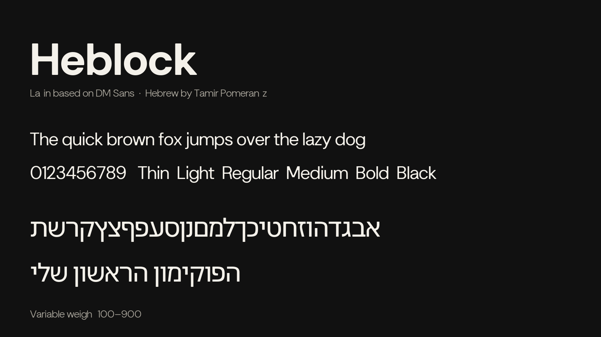
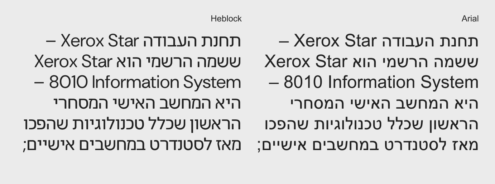
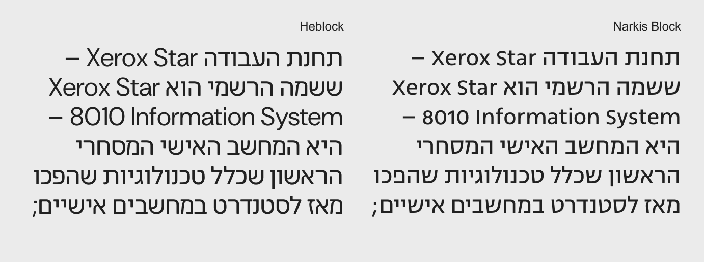
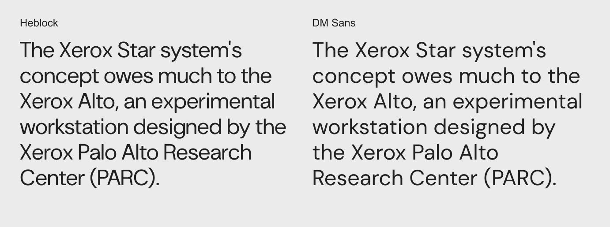

# Heblock

Heblock is a geometric Hebrew and Latin sans-serif for everyday use:
presentations, headlines, interfaces, and running text. It is meant to be
neutral and highly legible — a relatively transparent vessel so the content
stays in front, rather than the letters competing for attention.

Hebrew draws on the skeletons of Zvi Narkiss (especially Narkiss Block and
Narkiss Tam) and on the everyday presence of Arial. Latin is based on
[DM Sans](https://fonts.google.com/specimen/DM+Sans) by Colophon Foundry
([sources](https://github.com/googlefonts/dm-fonts)), with selected letters
adjusted so both scripts belong to one system. Hebrew and Latin production
are by Tamir Pomerantz.



## Design Rationale

In 1958, Zvi Narkiss arrived at a major milestone in the Hebrew sans-serif.
In Narkiss Block and Narkiss Tam he defined a formal system that is neutral
and readable while still having a clear character. Almost every later Hebrew
sans has had to contend with that canon — either by emphasizing its own
voice, as in The Basics by Michal Sahar or
[Assistant](https://fonts.google.com/specimen/Assistant) by Ben Nathan, or by
staying close to the skeletons Narkiss left behind.

This project started from the sense that [Google Fonts](https://fonts.google.com)
was missing Hebrew typefaces that were genuinely neutral for daily use. At
the time the work was happening next to
[Roboto](https://fonts.google.com/specimen/Roboto), and the Hebrew counterpart
did not need to feel radically different from Arial.
[Heebo](https://fonts.google.com/specimen/Heebo) is a strong design, but it
has a very distinct formal character. Heblock aims instead at the same idea
that sits behind Roboto: a “crystal goblet,” useful for long stretches of
text without drawing attention to itself.

## Sources and Formal History

Some letters come from the Hebrew faces Narkiss developed in the 1950s, with
proportions, width, and texture shifted toward headlines and shorter texts.
Others turn toward Narkiss Tam, from which some of the character of Hebrew
Arial on Windows was derived. Arial is not an accidental reference: it has
become almost invisible through constant use on the web, in documents, and in
Google Docs.



Alongside Narkiss, Arial is a central source. Basic forms such as פ and ש are
directly influenced by it. Other letters return to the logic of Narkiss Block:
מ is built inside an almost square frame, and ק and ל follow that language
as well.



## The Connection to DM Sans

The work began next to Roboto, then moved to
[DM Sans](https://fonts.google.com/specimen/DM+Sans) as a Latin foundation that
would sit more naturally with contemporary Latin typography. Hebrew letters
were widened slightly to approach the Latin proportions and to even out the
texture between the two scripts.

Heblock is not a direct translation of DM Sans into Hebrew. The DM Sans
masters were also changed so the two scripts form one system. In Latin, the
lowercase *a* has a more diagonal join to the stem; *t* and *f* are slightly
more square; some square punctuation became round; *Y*, *M*, *V*, and *W*
lost some of the breaks of original DM Sans; *G* has a more stable leg; and
*R* has a slightly more distinctive join, to relate to the Hebrew connections.



The aim is not a “Hebrew DM Sans,” but a bilingual family in which Hebrew and
Latin feel as if they belong to the same typographic world.

## About

- **Hebrew design and production:** Tamir Pomerantz
- **Latin (DM Sans):** Colophon Foundry, Jonny Pinhorn; selected Latin
  adjustments by Tamir Pomerantz
- **Formal sources:** Zvi Narkiss (Narkiss Block, Narkiss Tam); Hebrew Arial
- **Styles:** static Thin through Black (100–900)
- **Scripts:** Hebrew (including niqqud) and Latin (GF Latin Core, from DM Sans)

## Building

Fonts are built with [gftools](https://github.com/googlefonts/gftools) / Fontmake.

```
make build
```

Quality checks (FontBakery / Fontspector):

```
make test
```

Binaries are written to `fonts/ttf` and `fonts/webfonts`.

## Changelog

**25 August 2026. Version 1.000**

- SIGNIFICANT New family Heblock, based on DM Sans Latin with added Hebrew.

## License

This Font Software is licensed under the SIL Open Font License, Version 1.1.
This license is available with a FAQ at https://openfontlicense.org

## Repository Layout

This font repository structure follows the
[Google Fonts Project Template](https://github.com/googlefonts/googlefonts-project-template)
and the [Google Fonts Guide](https://googlefonts.github.io/gf-guide/).
